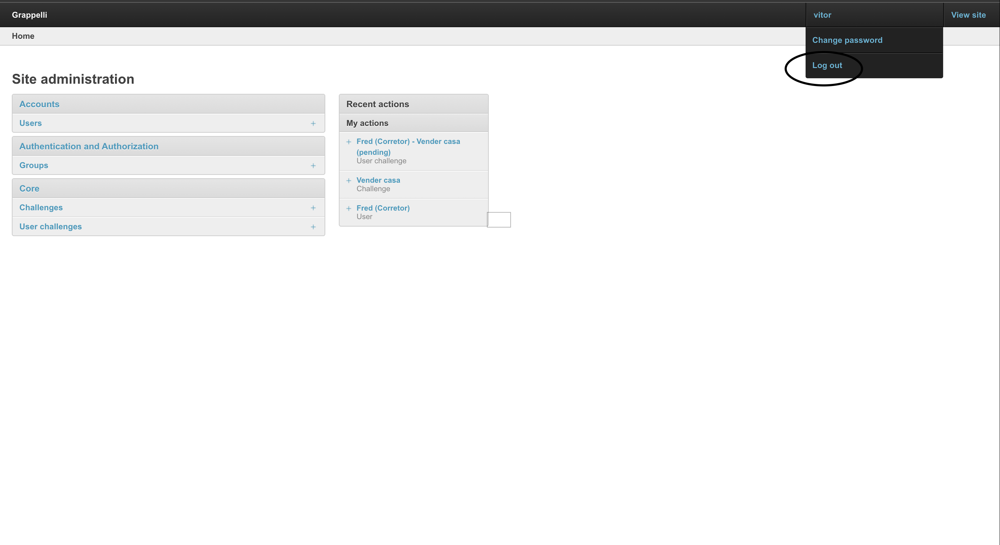

# Desafio Salesrun

Desenvolver um portal de campanhas de gamificação onde administradores podem gerenciar campanhas e corretores podem participar dos desafios.

## Stack utilizada

**Front-end:** Django Templates com CSS Customizado.

**Back-end:** Python, Django

## 📋 Funcionalidades Principais

- **Corretores**:
  - Visualizar desafios atribuídos.
  - Aceitar ou recusar desafios.
  - Concluir desafios e acumular pontos.
  - Visualizar o ranking de corretores.

- **Administradores**:
  - Gerenciar usuários.
  - Criar, editar e excluir desafios.
  - Atribuir desafios para corretores via CPF.

- **Ranking Dinâmico**:
  - Corretores podem acompanhar sua posição no ranking baseado nos pontos acumulados.

---

## 🛠️ Pré-requisitos

Certifique-se de que você possui as seguintes ferramentas instaladas:

- [Docker](https://www.docker.com/)
- [Docker Compose](https://docs.docker.com/compose/)
- [Git](https://git-scm.com/)


## 🚀 Instalação

Clone o repositório
```bash
git clone https://github.com/VitorMoo/DesafioSalesRun.git
cd DesafioSalesRun
```

Build e inicie os containers
```bash
docker-compose up --build
```

Aplicar as migrações
```bash
docker-compose exec web python manage.py migrate
```

Criar um superusuário
```bash
docker-compose exec web python manage.py createsuperuser
```


    
# 📘 Fluxo de Uso

## 1. Acesse o Painel de Administração
- **URL:** [http://localhost:8000/admin](http://localhost:8000/admin)
- Faça login com o superusuário criado durante a configuração inicial do sistema.

---

## 2. Gerencie Usuários e Desafios
No painel administrativo, siga os passos abaixo:

### Criar um Usuário
2. Clique em **Users**.
1. Clique em **Add Users**.
3. Preencha os dados do novo corretor e salve.

### Criar um Desafio
1. Volte ao Home.
2. Clique em **Challenges**.
3. Clique em **Add Challenges**.
4. Preencha as seguintes informações:
   - **Nome**: Dê um nome ao desafio.
   - **Descrição**: Detalhe o desafio.
   - **Regras**: Defina as regras de pontuação.
   - **Banner**: Adicione uma imagem representativa.
   - **Pontuação**: Determine os valores de pontuação.
5. Salve o desafio.

### Atribuir o Desafio ao Corretor
1. Volte ao Home.
2. Clique em **User Challenges**.
3. Clique em **Add User Challenges**.
4. atribua-o ao usuário corretor desejado.
3. Salve as alterações.

---

## 3. Faça Logout

- Após concluir as operações administrativas, **faça logout** do Painel de Administração para evitar o uso indevido das informações administrativas no Portal dos Corretores.

---

## 4. Acesse o Portal dos Corretores
- **URL:** [http://localhost:8000](http://localhost:8000)
- Faça login utilizando as credenciais do corretor recém-criado.

---

## 🚀 Próximos Passos
- Aceite ou recuse a participação nos desafios.
- Visualize detalhes completos dos desafios diretamente no portal.
